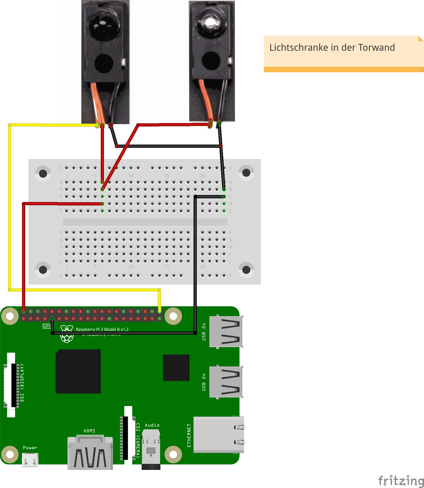
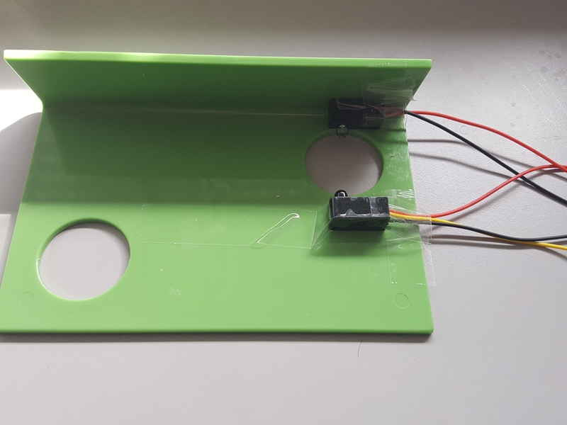
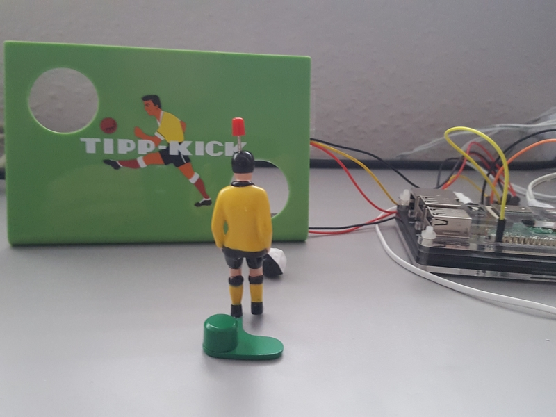
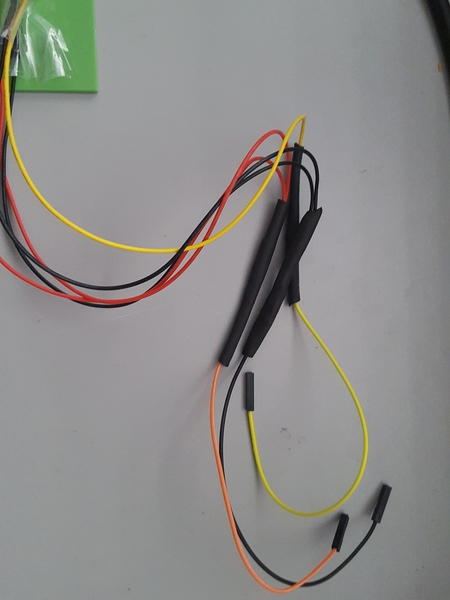

# Tipp-Kick-Torwand mit Lichtschranke & Rasperry Pi

Beim Treffer wird die Lichtschranke durch den Ball ausgelöst. Die verwendete Lichtschranke verhält sich, wie ein Taster. Die Lichtschranke kann also mit dem internen Pull-up-Widerstand genutzt werden. Um die Kabel zu reduzieren und direkt auf einen Raspberry Pi einzustecken, habe ich die Kabel zusammengefasst und ein entsprechendes GPIO-Kabel angelötet. Die Lötstellen sind mit etwas Isolierband und Schrumpfschlauch fixiert und haltbar gemacht.

## Material
+ Tipp-Kick-Torwand aus Kunststoff
+ IR Break Beam Sensors 5mm von Adafruit
+ Isolierband
+ Schrumpfschlauch
+ GPIO-Kabel

## Aufbau

